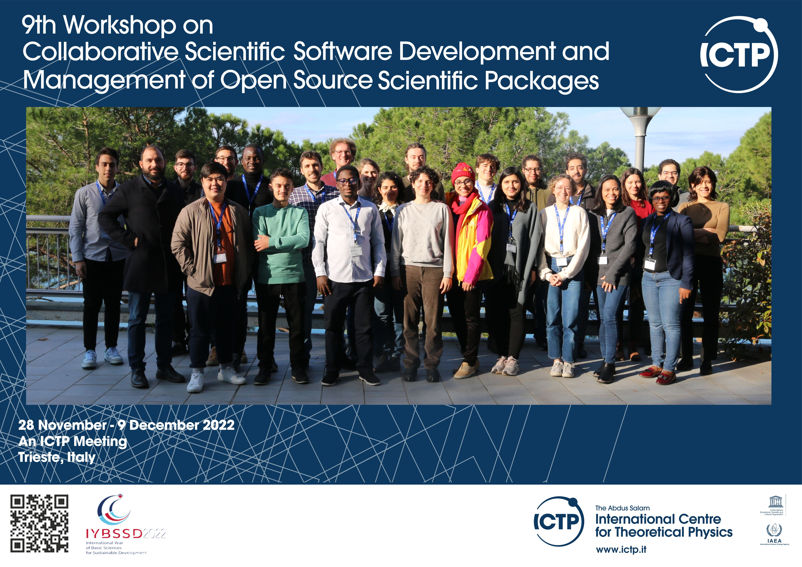

Introduction
============

Starting at the Beginning
-------------------------

This project originated as our final project during the 9th Workshop on Collaborative Scientific Software Development and Management of Open Source Scientific Packages, held at the International Centre for Theoretical Physics (ICTP) in the picturesque city of Trieste, Italy.

MockWalkers in a nutshell
-------------------------

Put simply, MockWalkers is a library designed to simulate human walking behavior in custom environments.
Our approach draws inspiration from Helbing and Molnar's "Social force model for pedestrian dynamics" (Phys. Rev. E, 1995).

A Big Shout-Out
---------------

We'd like to extend our heartfelt appreciation to the workshop organizers for their exceptional efforts in creating an enlightening and thoroughly enjoyable experience.

|

